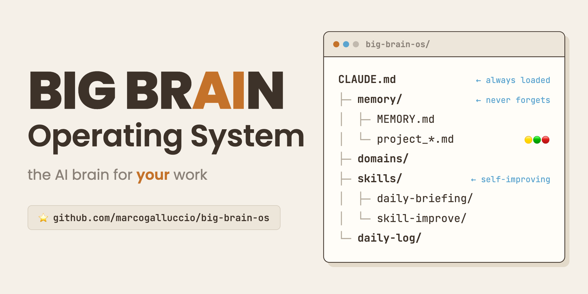

# Big Brain OS

### A personal brain for your work

Big Brain is a personal operating system for your work, built for [Claude Code](https://claude.ai/code). Instead of re-explaining yourself in every chat, you build a structured workspace that the agent reads automatically: who you are, what your work is about, the projects you are running, and the way you like to work. Every conversation starts with that context already loaded.

---

## The Three Core Ideas

### 1. CLAUDE.md hierarchy: layered context

Every folder has a `CLAUDE.md` that tells the agent what that area is about. Files load top-down: the root `CLAUDE.md` sets global rules and the way you work, subfolder `CLAUDE.md` files add focused context for that area.

```
CLAUDE.md                    (global rules, structure, boot sequence)
domains/
  clients-projects/
    CLAUDE.md                (loaded only when you work in this domain)
skills/
  daily-briefing/
    SKILL.md                 (skill definition and instructions)
```

The agent reads the root `CLAUDE.md` on every conversation. It reads subfolder files only when working in that area. Context stays focused, noise stays low.

### 2. File-based memory

Memory lives in `memory/` and persists across conversations. It is the source of truth for what is active, what is planned, and what has been decided.

```
memory/
  MEMORY.md                  (dashboard index, one line per item)
  project_*.md               (one file per active project)
  strategic_*.md             (long-term positioning and directions)
  feedback_*.md              (lessons learned, agent behavior rules)
  reference_*.md             (pointers to external resources)
```

`MEMORY.md` is the index. Individual files hold the full context and are read on demand. The **daily-briefing** skill reads `MEMORY.md` to build your priorities. The **session-debrief** skill updates it when you wrap up.

### 3. Work-domain subfolders

Each area of your work gets its own folder under `domains/`, with its own `CLAUDE.md` and `Context.md`. This keeps work organized without handing the agent everything at once. Three example domains ship with the template (`clients-projects/`, `learning-skills/`, `content/`); rename, replace, or delete them to fit your work.

```
domains/
  clients-projects/
    CLAUDE.md                (what this domain is about)
    Context.md               (background, goals, contacts, links)
```

---

## Two levels of memory

Big Brain ships with a light **Core** layer that works immediately: projects, strategic notes, references, and feedback, tracked in plain markdown.

When you want more, an opt-in **Advanced** layer adds salience scoring (hand-set, or computed by a deterministic formula), dated takes, and soft-delete, so the memory ages gracefully instead of growing forever. It is entirely optional. See [docs/ADVANCED.md](docs/ADVANCED.md).

---

## Quickstart

1. **Clone** this repo into your working directory.
2. **Install the Superpowers plugin.** In Claude Code, run `/plugin` and install Superpowers. This is the discipline layer the setup runs through.
3. **Set up the brain as a brainstorm.** Open the folder in Claude Code and say: `Let's set up my Big Brain. Use the Superpowers brainstorming skill.` The agent walks you through filling in `About Me - Context.md`, `Work - Context.md`, and your first domains, one question at a time.

Full walkthrough in [WELCOME.md](WELCOME.md). Technical setup (clone, memory path, plugins) in [SETUP.md](SETUP.md).

---

## File structure

```
big-brain-os/
  README.md                  (this file)
  WELCOME.md                 (first-run guide)
  SETUP.md                   (technical setup)
  CONTRIBUTING.md            (how to contribute)
  CHANGELOG.md               (version history)
  LICENSE                    (MIT)
  CLAUDE.md                  (root agent instructions)
  About Me - Context.md      (who you are: role, style, expertise)
  Work - Context.md          (what your work is about; optional)
  Workflows.md               (cross-domain workflow patterns)
  .gitignore
  .claudeignore
  domains/                   (one folder per area of work)
    clients-projects/        (example, deletable)
      CLAUDE.md
      Context.md
    learning-skills/         (example, deletable)
      CLAUDE.md
      Context.md
    content/                 (example, deletable)
      CLAUDE.md
      Context.md
  skills/
    daily-briefing/
      SKILL.md               (priority list from memory)
    session-debrief/
      SKILL.md               (logs session, updates memory)
    memory-checkup/
      SKILL.md               (read-only memory health audit)
    html-preview/
      SKILL.md               (renders markdown as styled HTML)
    skill-improve/
      SKILL.md               (turns logged friction into approvable diffs)
    _improvements/
      capture.md             (friction capture protocol)
      friction-log.md        (append-only friction telemetry)
  memory/
    CLAUDE.md                (memory rules and conventions)
    MEMORY.md                (dashboard index)
    project_template.md
    strategic_template.md
    feedback_template.md
    reference_template.md
    project_example.md       (example, deletable)
    archive/                 (closed memory files)
  daily-log/                 (daily session logs, one file per day)
    CLAUDE.md                (log conventions: sessions, Remember dates)
  docs/
    ADVANCED.md              (opt-in advanced memory layer)
    TOOLBELT.md              (recommended plugins and skills)
```

---

## Toolbelt

Big Brain is the context layer. The way you actually do the work (planning, building, debugging, research) comes from a small curated set of plugins. The recommended toolbelt is Superpowers (core), impeccable (interface design and polish), and deep-research (verified multi-source research); `html-preview` ships native. See [docs/TOOLBELT.md](docs/TOOLBELT.md) for what each one is for and when to install it.

---

## Skills included

| Skill | What it does | Trigger |
|-------|-------------|---------|
| `daily-briefing` | Reads `MEMORY.md` and recent logs, builds a priority list for today | "briefing" |
| `session-debrief` | Logs what happened, updates project files in memory | "debrief", "wrap up" |
| `memory-checkup` | Read-only health audit of the memory layer | "memory checkup" |
| `html-preview` | Renders any markdown file as styled HTML in your browser | "preview", "show me" |
| `skill-improve` | Turns logged friction into approvable improvement diffs for any skill | "improve the X skill" |

Each skill is a self-contained `SKILL.md`. Customize or replace any of them.

**The skills improve themselves.** Every native skill carries a `## Self-improvement` footer: when a run hits friction (an avoidable question, a broken step, redone work), the agent offers to log it to `skills/_improvements/friction-log.md`. The `skill-improve` meta-skill then turns those entries into concrete diffs that you approve one by one. Skills never edit themselves silently.

---

## License

Released under the [MIT License](LICENSE). Fork it, adapt it, build on it.
